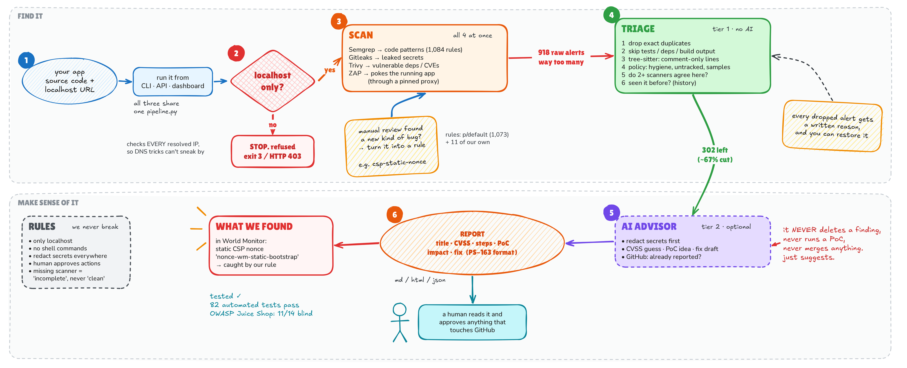

# Smart Security Pipeline

A local security review workbench for SIH PS-163 / World Monitor. It coordinates
Semgrep, Gitleaks, Trivy and OWASP ZAP, applies explainable JS/TS triage, and offers
optional AI advice and explicitly approved GitHub drafts. A finding is a lead,
not a proven vulnerability. Metrics always come from the current scan.



## Highlights

- **Localhost only.** Every resolved address must be loopback; anything else is
  refused (CLI exit code 3, API HTTP 403).
- **Explainable noise reduction.** On World Monitor, 918 raw alerts were cut to
  302 actionable leads (about 67%), each dropped alert with a written reason.
- **Manual findings become rules.** World Monitor's static CSP nonce
  (`nonce-wm-static-bootstrap`, the same value on every response) is now caught
  automatically by the `csp-static-nonce` rule. Evidence:
  [docs/static-nonce-evidence.png](docs/static-nonce-evidence.png).
- **Generalises.** On OWASP Juice Shop, an app it was not built for, it found 11
  of 14 known vulnerabilities blind.
- **Human in the loop.** AI advice is optional and only suggests; every GitHub
  action needs explicit approval.

## Architecture

```text
CLI / Streamlit / FastAPI
          |
     shared pipeline.py
          |
 source + optional local URL → resolve every A/AAAA address → refuse non-loopback
          |
 Semgrep + Gitleaks + Trivy + optional ZAP (concurrent, bounded processes)
          |
 normalized, redacted findings + per-scanner coverage
          |
 Tier 1: local path policy + Tree-sitter JS/TS comments + exact IDs + run history
          |
 Tier 2 (optional): offline estimates OR explicitly enabled external AI advice
          |
 optional GitHub issue matching → analyst reviews exact proposal
          |
 preview → approval bound to content and base revision → isolated draft PR
```

Tier 1 filtering is offline. Scanner collection defaults to offline settings too:
Semgrep uses a local copy of the `p/default` pack (see `fetch_rules.py`) plus the
bundled rules, Trivy requires cached databases/checks, and Docker will not pull a
missing ZAP image. Online mode uses the `p/default` registry pack (Semgrep refuses
`--config auto` while metrics are off). External downloads, registry rules, GitHub
and AI require online mode. Offline flags are not an operating-system network sandbox.

## Install

Python 3.11+ on Linux is the supported execution environment. ZAP currently uses
Docker host networking to reach the local test application and scope proxy.

```bash
python3 -m venv .venv
.venv/bin/python -m pip install -r requirements-dev.txt
# Or, with uv:
uv pip install --python .venv/bin/python -r requirements-dev.txt
```

Install scanner executables separately: Semgrep (`pip install semgrep` in this
venv), Gitleaks, Trivy and Docker. Executables placed in `.venv/bin/` are found even
when the venv is not activated. Preload the offline data once while online:

```bash
.venv/bin/python fetch_rules.py            # Semgrep p/default pack -> rules/p-default.yml
.venv/bin/trivy image --download-db-only   # Trivy vulnerability database
docker pull ghcr.io/zaproxy/zaproxy:stable # ZAP image (about 3.7 GB)
```

The `p/default` pack is covered by the Semgrep Rules License, so it is downloaded
locally and gitignored rather than shipped with this project.
Gitleaks uses directory scanning (`detect --no-git`), not historical Git commits.
Missing tools, missing offline databases, malformed reports and timeouts appear
as explicit coverage gaps. They do not count as successful checks.

`requirements.txt` bounds compatible direct dependencies; `requirements.lock`
records the resolved application environment for reproducible installs. Development
checks use `requirements-dev.txt`.

## Run

```bash
# Dashboard (local binding; keep Streamlit's XSRF protection enabled)
.venv/bin/python -m streamlit run app.py --server.address 127.0.0.1

# Offline static assessment; destination must not already exist
.venv/bin/python cli.py --src /path/to/worldmonitor --json new-report.json

# Also assess the locally running app, and write an assessment report
.venv/bin/python cli.py --src /path/to/worldmonitor --url http://localhost:3000 \
  --json scan.json --report assessment.md      # or assessment.html

# Build a report later from a saved scan
.venv/bin/python assessment_report.py scan.json assessment.html

# Online scanners + explicitly opted-in advisory AI
.venv/bin/python cli.py --src /path/to/worldmonitor --online --tier2 --allow-llm

# API (one worker; API scans are serialized within that worker)
.venv/bin/python -m uvicorn main:app --host 127.0.0.1 --port 8000
```

CLI exit codes: **0** all requested scanners completed, **1** invalid input,
**2** incomplete scanner coverage, **3** unauthorized target. A completed scan
can still contain vulnerabilities. Tier 2 without `--allow-llm` uses offline
estimates and creates no patch. `--online` alone does not consent to AI uploads.

Example API request:

```bash
curl -X POST http://127.0.0.1:8000/scan \
  -H 'Content-Type: application/json' \
  -d '{"target_dir":"/path/to/worldmonitor","offline":true}'
```

| Route | Behavior |
|---|---|
| `GET /health` | Liveness and parser/AI configuration; not scanner readiness |
| `POST /scan` | Scanner collection + deterministic triage |
| `POST /scan/full` | Adds advisory analysis; external calls remain opt-in |
| `POST /github/draft-issue` | Issue payload preview only |
| `POST /github/draft-pr` | Read-only GitHub base validation and PR preview |

All GitHub writes through HTTP are refused. Use the Streamlit approval workflow.
The API allows loopback clients by default; `SSP_API_TOKEN` switches it to bearer
authentication. `SSP_SOURCE_ROOT` optionally restricts API source paths. Do not
expose the dashboard publicly without a separately authenticated deployment.

## Configuration

Export variables in the process environment; `.env.example` is a template and
is not automatically loaded. Never commit real credentials.

| Setting | Use |
|---|---|
| `GITHUB_TOKEN` | Read issues; approved writes need repository push access and token permissions |
| `OPENAI_API_KEY` / `ANTHROPIC_API_KEY` / `LITELLM_API_KEY` | Optional provider credentials; choose the matching model |
| `SSP_API_TOKEN` | Bearer token required for all API routes when set |
| `SSP_SOURCE_ROOT` | Optional API source-directory boundary |
| `SSP_STATE_DIR` | Private SQLite history/audit directory; defaults to `.ssp/` |
| `SSP_ZAP_IMAGE` | ZAP image override; pin an image digest for controlled deployments |

## Deterministic decisions

- Scan IDs preserve tool and full rule names, repository-relative file paths,
  line numbers, and web endpoints. Trivy IDs distinguish affected packages.
- Exact duplicates disappear but the raw count remains unchanged.
- JS/TS test, mock and generated/build paths are filtered by explicit policy;
  filtered evidence remains visible and can be restored by a reviewer.
- Credentials and dependency/configuration findings are **not** dismissed simply
  because they occur in tests. A real test credential is still a credential.
- Credential matches are filtered, with a stated reason, only when they sit in
  documentation, generated or sample files, installed dependency code
  (`node_modules`, `vendor`, `.venv`, ...), or files git does not track (a local
  `.env` or a saved scan report is not a repository leak). Credential matches in
  test code stay actionable but are downgraded to LOW, since they are usually
  fixtures; build output such as `dist/` stays at full severity because it ships.
- Semgrep rule IDs are stored without the local folder prefix Semgrep adds for
  rule files, so fingerprints match across machines and install locations.
- A few low-signal hygiene rules (`unsafe-formatstring`, `header-redefinition`,
  `dependabot-missing-cooldown`) and informational-risk ZAP alerts are filtered by
  policy. Every policy-filtered finding can be restored.
- Semgrep per-file timeouts and partial parses are reported as warnings; only
  error-level Semgrep problems mark the scan as failed.
- Tree-sitter uses the maintained JavaScript and TypeScript/TSX grammar wheels.
  Only comment-only lines are dismissed; mixed code/comment lines, strings,
  parser errors and unreadable files remain actionable. This is syntax scoping,
  not whole-program reachability or data-flow proof.
- Local SQLite history labels previously observed actionable IDs as known. This
  means previously seen, not fixed. History is isolated by source directory.
- GitHub matching checks up to 500 open `security` issues, exact fingerprint
  markers and case-normalized partial similarity above 85 against titles of at
  least four words (short titles such as "XSS" would otherwise match anything).
  Similarity is a hint, not proof. Failed lookups are shown as warnings.

## Assessment reports

`assessment_report.py` turns any scan into a report in the SIH PS-163 template:
title, description, affected components, severity with a CVSS estimate, OWASP
Top 10 category, steps to reproduce, proof of concept, business impact and
remediation. Findings sharing a rule and severity are grouped, so a scan with
hundreds of alerts reads as a few dozen sections. The report also lists scanner
coverage and what was filtered and why.

Available as Markdown or standalone HTML from the CLI (`--report`), from a saved
scan (`assessment_report.py scan.json out.md`), and as downloads in the dashboard.
HTML escapes every value and all output is redacted again before writing. Nothing
is labelled confirmed: a report entry is a lead until a person reproduces it, and
the proof of concept is only a read-only probe the tool never executes.

## Rules from manual review

`rules/manual-lessons.yml` turns bug classes found by manual review into rules
that run on every scan: a hard-coded CSP nonce, a proxy injecting an internal
credential into forwarded requests, and unescaped interpolation into XML/RSS
elements. Each targets a class of bug, not one line.

`rules/coverage-extras.yml` adds standard OWASP classes that `p/default` does not
cover: Angular `bypassSecurityTrust*` on non-constant values (XSS), MongoDB `$where`
built from non-constant strings (NoSQL injection), and MD5/SHA-1 inside
password/token/auth functions. The hash rule is deliberately narrow: MD5 for file
checksums is common and harmless.

`rules/review-candidates.yml` is opt-in. It flags string fields interpolated into
HTML templates without escaping. It is high-recall: on a large codebase it also
returns many mostly-safe matches, so it is meant for a manual review pass
(`--semgrep-config rules/review-candidates.yml`), not the default scan.

## Advisory and approval boundaries

AI receives a bounded, redacted evidence object, not the whole repository.
Every returned result is validated with strict Pydantic types and score bounds.
AI false-positive suggestions **never automatically remove findings**. CVSS and
confidence are estimates, not calibrated risk measurements. External AI errors
fall back to clearly marked offline estimates. AI calls have a timeout and no
automatic retries. Large scans may take time because advisory calls are serial.

PoC text is constructed as a local read-only HEAD probe; arbitrary model commands
are discarded. Nothing executes a PoC. Suggested diffs are displayed, not applied.

1. Select a finding and optionally edit its suggested unified diff.
2. Choose the destination repository and base branch.
3. Generate a preview. PR previews fetch the base files and verify every context
   line in memory; no local source changes occur.
4. Read the complete diff and destination, tick the approval checkbox, then click
   **Approve & Create Draft PR**.
5. The app verifies the preview fingerprint and unchanged base revision, records
   approval, creates Git blobs/tree/commit, creates a separate branch, and opens
   a **draft** PR. The base branch and local checkout remain untouched.

Patches currently support up to ten existing UTF-8 files, not new/deleted/renamed
files, binaries, symlinks, submodules, workflow files or credential files. This
conservative boundary is intentional. Redacted placeholders cannot be committed
as source. A changed form or base revision requires a fresh preview and approval.
No test or build of the proposed patch is implied by contextual validation.

GitHub has no draft issue state: an issue preview is local, but **Approve & Create
Issue** creates a visible issue. A failed/uncertain GitHub mutation is never
retried automatically. Inspect GitHub and `.ssp/history.sqlite3` approval records;
a branch may already exist. Approval fingerprints cannot be reused.

## Scope and data protection

The guard accepts only HTTP(S), resolves every address (including `localhost`),
and rejects public, private-LAN, mixed-address, credential-bearing and malformed
URLs. Non-loopback internal environments are intentionally not allowlisted.
Bind the authorized test environment to loopback instead.

ZAP receives a per-scan HTTP upstream proxy. It only permits the approved host
and port and connects to the previously checked IP. Redirects to other origins
and third-party resources are refused. HTTPS uses a CONNECT tunnel to that same
pinned destination. A startup hook removes proxy bypasses and fails closed if
configuration fails. Form submission is disabled. This boundary governs ZAP's
configured HTTP client; it does not sandbox Docker, a compromised scanner, or an
application that itself makes external requests. GET/HEAD requests can still
have effects in badly designed applications.

Redaction is best-effort, applied before model calls, persistence, exports and
display. Secret-scanner evidence is discarded entirely. Pattern matching cannot
recognize every possible credential. Only send application code to an external
provider when authorized. Scanners are trusted external programs; their own
caches and diagnostics are outside this report redaction boundary.

## Project files

| File | Responsibility |
|---|---|
| `models.py` | Validated findings, scanner states, counts and options |
| `scope_guard.py`, `scope_proxy.py` | Target authorization and pinned ZAP egress |
| `runner.py` | Bounded async processes, parsing, snippet recovery and coverage |
| `triage_tier1.py` | Offline JS/TS syntax/path filtering and dedup |
| `triage_tier2.py`, `redaction.py` | Optional advice and data redaction |
| `history.py` | SQLite run history and durable approval audit |
| `github_sync.py` | Known issue matching, strict patch previews, approved drafts |
| `pipeline.py` | Shared orchestration for all interfaces |
| `assessment_report.py` | SIH-template assessment reports (Markdown/HTML) |
| `main.py`, `cli.py`, `app.py` | API, terminal and analyst dashboard |
| `rules/baseline.yml` | Small bundled Semgrep ruleset |
| `rules/manual-lessons.yml` | Bug classes from manual review, run on every scan |
| `rules/coverage-extras.yml` | OWASP classes missing from `p/default`, run on every scan |
| `rules/review-candidates.yml` | Opt-in high-recall rules for a manual review pass |
| `fetch_rules.py` | Downloads the `p/default` pack for offline scanning |
| `tests/` | Regression checks for trust boundaries and data handling |

`target-app/a.js` is a minimal sample target. No scanner counts or
noise-reduction targets are hardcoded to match a presentation.

## Validation

```bash
.venv/bin/python -m pytest -q
.venv/bin/ruff check .
.venv/bin/ruff format --check .
```

Tests use mocked scanner/GitHub/AI responses plus real Tree-sitter parsing and a
local HTTP proxy fixture. They do not publish GitHub content or call paid models.
Validate the actual scanner versions, cached databases, container image and an
approved staging repository before deployment. Without `rules/p-default.yml`,
offline scans run only the small bundled rules and say so in the scan details.

Implementation references: [Tree-sitter Python API](https://tree-sitter.github.io/py-tree-sitter/),
[PyGithub repository API](https://pygithub.readthedocs.io/en/latest/github_objects/Repository.html),
[ZAP baseline scan](https://www.zaproxy.org/docs/docker/baseline-scan/) and
[ZAP scan hooks](https://www.zaproxy.org/docs/docker/scan-hooks/).
